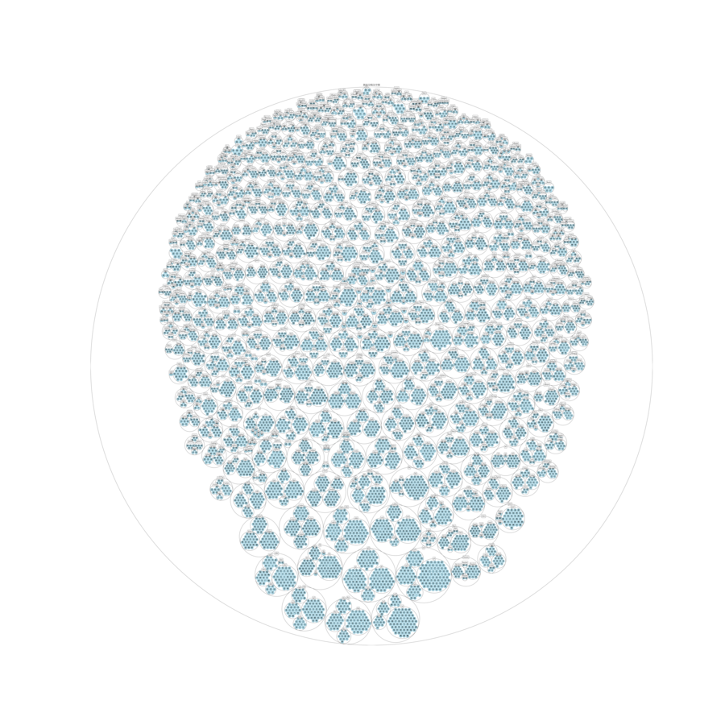
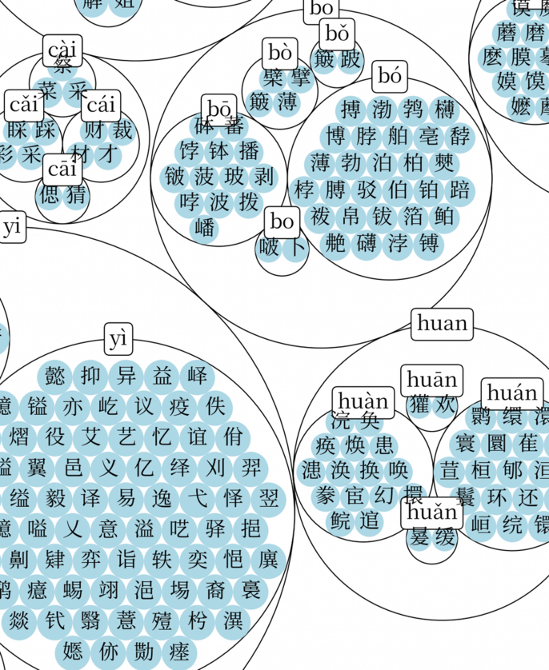

The file =main.py= contains Python code to create an image showing the 8105 characters from [[https://www.wikidata.org/wiki/Special:GoToLinkedPage/enwiki/Q14941454][通用规范汉字表]] grouped by pinyin.

The size of the output image is 42 MB, so it hasn't been included in this repository. You can download the image in full resolution from [[https://commons.wikimedia.org/wiki/File:Characters_from_the_%22List_of_Commonly_Used_Standard_Chinese_Characters%22_grouped_by_pinyin.png][Wikimedia Commons]].

Here are some sample images of how that big image looks:

